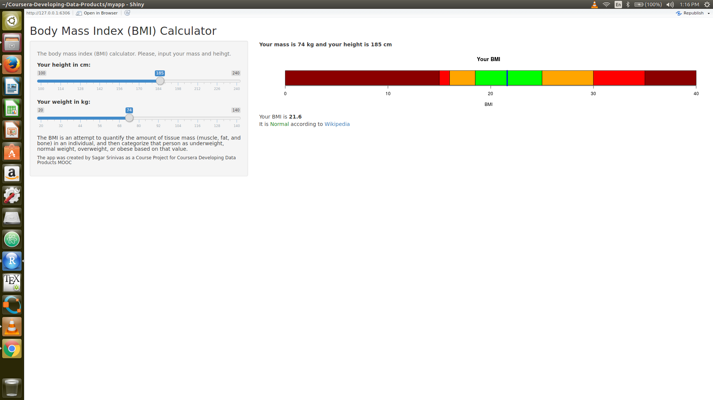

# Body mass index (BMI) calculator

Course Project for Coursera Developing Data Products MOOC
The app is a simple body mass index (BMI) calculator. It was developed as a R Shiny app.
# Look at myapp folder for server.R and ui.R Files

## **[Go to the web app](https://sakhinanasagarsrinivas.shinyapps.io/myapp/)**




## **[Go to Rpubs for Presntation](http://rpubs.com/sakhinanasagarsrinivas/314267)**
---
title: "README"
author: "Sagar Srinivas"
date: "October 2, 2017"
output: html_document
---

# Shiny app to calculate Body Mass Index (BMI)


### 1. Instructions given for this course assignment

1. Write a shiny application with associated supporting documentation. The documentation should be thought of as whatever a user will need to get started using your application. 
2. Deploy the application on Rstudio's shiny server.
3. Share the application link by pasting it into the text box below. 
4. Share your server.R and ui.R code on github. 

The application must include the following:

1. Some form of input (widget: textbox, radio button, checkbox, ...).
2. Some operation on the ui input in sever.R.
3. Some reactive output displayed as a result of server calculations.
4. You must also include enough documentation so that a novice user could use your application.
5. The documentation should be at the Shiny website itself. Do not post to an external link.

The Shiny application in question is entirely up to you. However, if you're having trouble coming up with ideas, you could start from the simple prediction algorithm done in class and build a new algorithm on one of the R datasets packages. Please make the package simple for the end user, so that they don't need a lot of your prerequisite knowledge to evaluate your application. You should emphasize a simple project given the short time frame.  

### 2. A description of this Shiny app

This Shiny app  acquires input values from the user to calculate Body Mass Index for a variety of heights and weights. My interest in physical fitness and weight-to-height ratios motivated me to create this app. A user can check his or her index as their weight changes. 

It contains two inputs, one for height in cm and the other  for weight in kg, and calculates BMI based on the following formula:
``` {r}
BMI = function(height,weight){
        return(0.45455*weight/(.0254*height)^2)
}
```
The function takes two arguments, height and weight, and returns a numerical value based on a simple formula.
