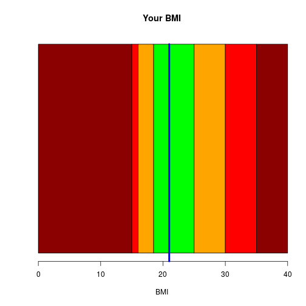

Body Mass Index (BMI) Calculator
========================================================
author: Sagar Srinivas
date: 02/11/2017
autosize: true
transition: rotate
Course Project: Shiny Application and Reproducible Pitch


Overview
========================================================

The goal of the project was to create a simple Body Mass Index (BMI) Calculator.

The BMI is an attempt to quantify the amount of tissue mass (muscle, fat, and bone) in an individual, and then categorize that person as underweight, normal weight, overweight, or obese based on that value.


Mass should be in kg, height in m. Your mass and height should be provided as input by two sliders.

[The app itself on the shiny server](https://sakhinanasagarsrinivas.shinyapps.io/myapp/)

Calculations
========================================================
Calculations and rounding performed by the a simple code. Here we convert cm into m by dividing by 100.

```r
bmi = round(mass/(height/100)^2, 1)
```
The following code is used to plot the calculated BMI as compered to [Categories](https://en.wikipedia.org/wiki/Body_mass_index#Categories). Green area is a normal BMI.

```r
dat<-matrix(c(15, 1, 2.5 ,6.5 , 5, 5, 5), ncol = 1, nrow = 7)
barplot(dat, horiz = TRUE, yaxt="n", xlab = "BMI", main="Your BMI", col=c("darkred", "red", "orange", "green", "orange", "red", "darkred", "brown")); lines(x=c(21, 21), y=c(0,1.2), col="blue", lwd=4)
```


Plot
========================================================
This example represents BMI=21.



Links
========================================================

[The Source code for the project](https://github.com/sakhinanasagarsrinivas/DevelopingDataProductsWeek4)

[The app itself on the Shiny server](https://sakhinanasagarsrinivas.shinyapps.io/myapp/)

More about the BMI Categories on [Wikipedia](https://en.wikipedia.org/wiki/Body_mass_index#Categories)
